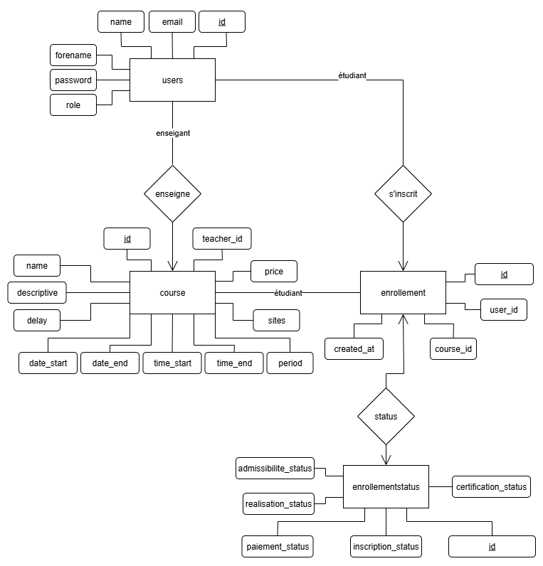
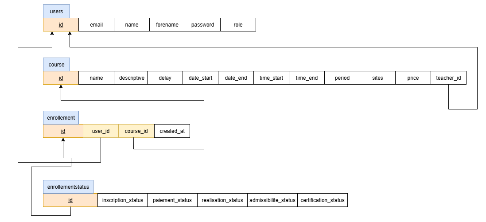

# SmartLearn: plateforme d'inscription à des cours

## 👥 Auteurs

- **Marco Dolci**  
- **Christophe Debons**

---

## 1. 🎯 Description générale

Ce projet consiste à développer une application Web en **PHP**, basée sur le **framework MVC** réalisé durant le cours.  
L’objectif est de permettre :

- la gestion de cours par les enseignants  
- l’inscription et le suivi des cours par les étudiants  

Deux rôles sont gérés :

- **Enseignant** : crée et gère ses cours, visualise les étudiants inscrits, met à jour les pastilles de suivi  
- **Étudiant** : consulte les cours, s’inscrit, suit l’avancement de ses inscriptions  

L’application repose sur :

- PHP + MVC du cours  
- PDO + ORM Model fourni  
- HTML / CSS
- Git (projet sur la branche 'smartlearn-main')  
- Base de données MySQL

---

## 2. 🎯 Objectifs pédagogiques

- Appliquer le modèle MVC et la POO  
- Utiliser le framework du cours pour structurer le code  
- Gérer une base de données relationnelle via PDO  
- Implémenter des formulaires sécurisés (validation + échappement)  
- Travailler en équipe avec Git (workflow propre)  
- Fournir :
  - une classe documentée en **phpdoc**
  - une classe testée avec **PHPUnit**
  - une documentation technique (schémas, routes, opérations)

---

## 3. 🧩 Fonctionnalités

### 3.1 Gestion des utilisateurs

- Inscription / connexion  
- Rôles : enseignant / étudiant  
- Page profil  

### 3.2 Gestion des cours

- Enseignant : créer, ses cours  
- Étudiant : consulter les cours disponibles

### 3.3 Inscriptions aux cours

- Étudiant : s’inscrire
- Enseignant : voir les étudiants inscrits à ses cours  

### 3.4 Suivi avancement (pastilles)

Chaque inscription possède un état d’avancement :

- Inscription  
- Admissibilité  
- Paiement  
- Réalisation  
- Certification  

Une table dédiée a été ajoutée pour gérer ces statuts (`enrollmentstatus`).  
Les pastilles sont mises à jour via AJAX (JS) par l'enseignant.

### 3.5 Sécurité

- Validation des champs  
- Échappement HTML (`Helper::e()`)  
- Vérification des rôles dans les contrôleurs  
- Try-Catch sur les zones sensibles

---

## 4. 🗄️ Modèle de données

### 4.1 Modèle conceptuel (Entités & Associations)

Ce schéma représente les relations entre les utilisateurs, les cours, les inscriptions et les statuts d’inscription.



---

### 4.2 Schéma relationnel

Voici la structure relationnelle utilisée dans la base de données SQL.



---

### Tables

#### `users`

- id  
- name  
- forename  
- email  
- password  
- role (teacher / student)

#### `courses`

- id
- name
- descriptive
- delay
- date_start
- date_end
- time_start
- time_end
- days
- period
- sites
- price
- teacher_id   (FK → users.id)

#### `enrollments`

- id
- user_id      (FK → users.id)
- course_id    (FK → courses.id)
- created_at

#### `enrollmentstatus`

- id        (PK = FK → enrollment.id)
- inscription_status
- admissibilite_status
- paiement_status
- realisation_status
- certification_status

---

## 5. 🌐 Routes

| URL               | Méthode  | Contrôleur            | Action          | Description action                               | Rôle               |
|-------------------|----------|-----------------------|-----------------|--------------------------------------------------|--------------------|
| /                 | GET      | IndexController       | index           | Navigation page d'accueil						|  public            |
| /index            | GET      | IndexController       | index           | Navigation page d'accueil						|  public            |
| /about            | GET      | AboutController       | index           | Navigation page à propos							|  public            |
| /login            | GET      | LoginController       | index           | Navigation page de login							|  public            |
| /login-user       | POST     | LoginController       | login           | Connexion de l'utilisateur						|  public            |
| /logout           | GET      | LoginController       | logout          | Déconnexion de l'utilisateur						|  teacher/student   |
| /register         | GET      | UserController        | register        | Navigation page de création de compte			|  public            |
| /create-user      | POST     | UserController        | add             | Création d'un nouvel utilisateur					|  public            |
| /user             | GET      | UserController        | index           | Navigation page profil utilisateur				|  teacher/student   |
| /update-user      | POST     | UserController        | update          | Mise à jour du profil utilisateur actif			|  teacher/student   |
| /delete-user      | POST     | UserController        | delete          | Suppression du profil utilisateur actif			|  teacher/student   |
| /create-course    | GET      | CreateCourseController| index           | Navigation page de création d'un nouveau cours	|  teacher           |
| /add-course       | POST     | CreateCourseController| add             | Ajout d'un nouveau cours							|  teacher           |
| /list             | GET      | ListController        | index           | Navigation page liste des cours					|  teacher/student   |
| /enroll-course    | POST     | EnrollmentController  | add             | Inscription à un cours							|  student           |
| /my-courses       | GET      | MyCoursesController   | index           | Navigation vers page mes cours					|  student           |
| /student-progress | GET      | EnrollmentController  | studentProgress | Navigation vers page suivi des étudiants			|  teacher           |
| /update-pastille  | POST     | EnrollmentController  | updatePastille  | Mise à jour état avancement du processus			|  teacher           |

---

## 6. 🔄 Schémas d’opérations

### Inscription d’un étudiant

1. L’utilisateur remplit le formulaire  
2. Validation des données  
3. Insertion dans `users` (rôle = student)  
4. Redirection vers login  

### Inscription à un cours

1. L’étudiant clique sur *S’inscrire*  
2. Vérification du rôle et de l’existence du cours  
3. Insertion dans `enrollments`  
4. Création automatique d’un `enrollmentstatus` par défaut  
5. Redirection vers "Mes cours"  

### Création d’un cours (enseignant)

1. Formulaire rempli  
2. Validation  
3. Insertion dans `courses`  
4. Redirection vers "List" 

---

## 7. 🧱 Classes principales

- **User** (Model) — documentée en phpdoc
- **Course** (Model) — documentée en phpdoc
- **Enrollment** (Model) — documentée en phpdoc  
- **EnrollmentStatus** (Model) — documentée en phpdoc  
- **EnrollmentCourse** (DTO générique pour les vues étudiant/enseignant)  
- **UserController** (Controller)
- **EnrollmentController** (Controller)
- **CreateCourseController** (Controller)
- **MyCoursesController** (Controller)  
- **ListController** (Controller)  

---

## 8. 🧪 Tests unitaires

- Tests PHPUnit réalisés sur la classe `NavigationHelper`  
- Vérification du comportement du bouton de navigation selon la page courante  
- Simulation de l’environnement avec `$_SERVER` et `$_SESSION`  
- Exécution des tests via Docker :

```bash
docker-compose exec web bash
cd /var/www/html/smartlearn
vendor/bin/phpunit tests
```

Résultat attendu : OK (2 tests, 4 assertions)

---

## 9. 📱 UX & Responsiveness

- Thème sombre modernisé  
- Pastilles interactives (JS)  
- Interface claire et cohérente  
- Layout responsive  
- Messages d’erreur / succès  

---

## 10. 👤 Utilisateurs de test

Pour faciliter les tests, plusieurs comptes sont déjà présents dans la base :

| Email           | Rôle      |
|-----------------|-----------|
| dm@gmail.com    | student   |
| dc@gmail.ch     | student   |
| mh@gmail.ch     | teacher   |
| sm@gmail.ch     | teacher   |

🔐 **Mot de passe unique pour tous les comptes :** `1234` 

## 11. 🌐 **Consulter l'application en ligne :**  
  
L'application web est en ligne à l'adresse : [https://smartlearn.experts-meca.ch](https://smartlearn.experts-meca.ch)

## 12. 🖥️ **Lancement de l'application avec Docker :**

L'application peut être lancée avec Docker en suivant les étapes suivantes :

### 1. Arrêter les conteneurs existants

```bash
docker compose down
```
  
### 2. Nettoyer les volumes (optionnel)
```bash
docker volume prune -f  
```
  
### 3. Démarrer les conteneurs
```bash
docker compose up -d
```
ou avec le script du cours
```bash
 ./run.sh
```

### 4. Importer la base de données 
Ouvrez un deuxième gitbash, placez-vous où se trouve le fichier `smartLearn.sql`, puis exécutez :
```bash
docker exec -i aw_db mysql -u root -pdanger --default-character-set=utf8mb4 < smartLearn.sql  
```

### Accès à l'application

Une fois lancée, l'application est accessible à l'adresse :

http://localhost:8080

## 13. 📈 **Evolutions envisageables :**  
  
- Forcer un mot de passe fort (nombre de caractères minimal, caractère spécial, un chiffre, une majuscule, ...)
- Contrôle si adresse e-mail valide (validation par validation e-mail) 
- Ne plus afficher un cours échue (délai d'inscription passé)
- Créer un rôle Admin avec la possibilité d'attribuer le rôle "teacher"
- Ajouter la possibilité de supprimer ou mettre à jour un cours depuis le rôle enseignant# SmartLearn_PHP_application
